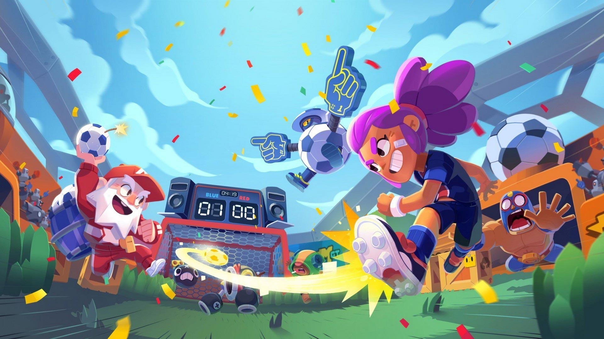

```{r setup, include=FALSE, message = FALSE}
library(tidyverse)
library(knitr)
library(AER)
library(tidyverse)
library(plotly)
library(flexdashboard)
enjoyability <- read_rds("enjoyability.rds")
brawler_stats <- read_rds("brawler_stats.rds")
map_ALL <- read_csv("map_ALL.csv")
`Bot Drop` <- read_csv("map_Bot_Drop.csv")
`Junk Park` <-  read_csv("map_Junk_Park.csv")
`Mecha Match` <-  read_csv("map_Mecha_Match.csv")
`Nuts & Bolts` <- read_csv("map_Nuts_&_Bolts.csv")
`Olive Branch` <- read_csv("map_Olive_Branch.csv")
`Robo Highway` <- read_csv("map_Robo_Highway.csv")
`Some Assembly Required` <- read_csv("map_Some_Assembly_Required.csv")
country_winnings <- read_rds("country_winnings.rds")
avg_level_diff <- read_rds("avg_level_diff.rds")
avg_trophy_diff <- read_rds("avg_trophy_diff.rds")
comp_data <- read_rds("compData.rds")

```

About
==========================
Column {data-width=400}
-------------------------

#### Authors
Ian & Swagat

#### Project Information and Goals
Brawl Stars is a multiplayer online battle arena and third-person hero shooter video game developed and published by the Finnish video game company Supercell. It was released worldwide on December 12, 2018 on iOS and Android. The game features various game modes, each with a different objective. Players can choose from a selection of Brawlers, which are characters that can be controlled with on-screen joysticks in a game match.

Our goal is to find how the selection of Brawlers match up against each other. We will do this by tracking their base stats as well as data on their win rate and usage. We want to analyze data on Brawlers that may not be readily available such as which Brawlers are fan favorites or which ones are favored in competitive play.

#### Data Sources
* https://brawlstars.fandom.com/wiki/Category:Brawlers
* https://brawlstats.com
* https://brawlcapped.com/content-creators
* https://www.esportsearnings.com/games/586-brawl-stars/countries


Row {data-width=400}
-------------------------
```{r  fig.width = 4, fig.height = 8}
#
#

renderImage({
  list(src = "Brawl3.png",
  alt = "This is alternate text")
})
```

Enjoyability of Character Archetypes
==========================
Inputs {.sidebar}
-------------------------


-------------------------
```{r, echo=FALSE}
classes <- (enjoyability %>% count(class))$class

inputPanel(
  selectInput("class",
              label = "Class",
              choices = classes)
)
```

Column {data-width=300}
-------------------------
```{r}
renderPlot({
   enjoyability %>%
    filter(class == input$class) %>%
  ggplot(aes(x = fct_reorder(Brawler, desc(rate_dif)), y = rate_dif)) +
    geom_col(aes(fill = rate_dif, width = 1), show.legend = FALSE)+
    labs( x = "Brawlers", y = "Enjoyability")
})
```

Column {data-width=150}
-------------------------

-------------------------

### Description/Evaluation

These graphs demonstrate how some data can be gathered even though it is not explicitly stated. How we interpreted "Enjoyability" is by comparing brawlers' win rate against their usage rates. If a brawler is stronger than others, they will be played more since they are seen as favorable by the community, and the opposite is true for brawlers that are weaker than others. This means that how strong a brawler is won't effect the comparison of win rate versus usage rate, however if a brawler is played a ton, even though they are weak, that will be reflected in a high enjoyablity score.

In laymen's terms; Enjoyable to play = usage rate > win rate, Not Enjoyable = win rate > usage rate
    
From the results, we can see a clear preference towards Assassin brawlers and an avoidance of Tank/Hybrid brawlers.


Ranking Characters By Specific Stats
==========================
Inputs {.sidebar}
--------------------------
```{r, echo = FALSE}

# titlePanel("Ranking Characters By Specific Stats")

inputPanel(
  selectInput(
    "x", label = "Character Stat",
    choices = c("Health" = "health",
                "Reload Speed" = "max_reload", 
                "Movement Speed" = "max_movement_speed", 
                "Super Width" = "max_super_width", 
                "Attack Width" = "max_attack_width", 
                "Attack Projectile Speed" = "max_attack_proj.spd", 
                "Super Projectile Speed" = "max_super_proj.spd")
 ),
 selectInput(
    "y", label = "Class",
    choices = c("Assassin",
                "Damage Dealer", 
                "Hybrid", 
                "Support", 
                "Tank")
 )
)
```


Column {data-width=320}
-------------------------
```{r}
theme_set(theme_bw())
theme_update(panel.grid.minor = element_line(colour = "lightgrey"),
             panel.grid.major = element_line(colour = "lightgrey"))

renderPlot({
    if (input$x == "health"){
      brawler_stats %>%
        mutate(class = ifelse(class == input$y, health, NA)) %>%
      ggplot()+
      geom_col(mapping = aes_string(x = "fct_reorder(brawler, health)", y = input$x, fill = "class", color = "class"),
             stat = "identity", show.legend = FALSE)+ 
      coord_flip()+
      labs(x = "Brawlers", y = "Health")}
    else if(input$x == "max_reload"){
      brawler_stats %>%
        mutate(class = ifelse(class == input$y, max_reload, NA)) %>%
      ggplot()+
      geom_col(mapping = aes_string(x = "fct_reorder(brawler, max_reload)", y = input$x, fill = "class"),
             stat = "identity", show.legend = FALSE)+ 
      coord_flip()+
      labs(x = "Brawlers", y = "Reload Time")}
    else if(input$x == "max_movement_speed"){
      brawler_stats %>%
        mutate(class = ifelse(class == input$y, max_movement_speed, NA)) %>%
      ggplot()+
    geom_col(mapping = aes_string(x = "fct_reorder(brawler, max_movement_speed)", y = input$x, fill = "class"),
             stat = "identity", show.legend = FALSE)+ 
      coord_flip()+
      labs(x = "Brawlers", y = "Movement Speed")}
    else if(input$x == "max_super_width"){
      brawler_stats %>%
        filter(max_super_width != 0)%>%
        mutate(class = ifelse(class == input$y, max_super_width, NA)) %>%
      ggplot()+
      geom_col(mapping = aes_string(x = "fct_reorder(brawler, max_super_width)", y = input$x, fill = "class"),
             stat = "identity", show.legend = FALSE)+ 
      coord_flip()+
      labs(x = "Brawlers", y = "Super Width")}
    else if(input$x == "max_attack_width"){
      brawler_stats %>%
        filter(max_attack_width != 0) %>%
        mutate(class = ifelse(class == input$y, max_attack_width, NA)) %>%
      ggplot()+
      geom_col(mapping = aes_string(x = "fct_reorder(brawler, max_attack_width)", y = input$x, fill = "class"),
             stat = "identity", show.legend = FALSE)+ 
      coord_flip()+
      labs(x = "Brawlers", y = "Attack Width")}
    else if(input$x == "max_attack_proj.spd")
      brawler_stats %>%
        filter(max_attack_proj.spd != 0) %>%
        mutate(class = ifelse(class == input$y, max_attack_proj.spd, NA)) %>%
      ggplot()+
      geom_col(mapping = aes_string(x = "fct_reorder(brawler,max_attack_proj.spd)", y = input$x, fill = "class"),
             stat = "identity", show.legend = FALSE)+ 
      coord_flip()+
      labs(x = "Brawlers", y = "Attack Projectile Speed")
    else if(input$x == "max_super_proj.spd"){
      brawler_stats %>%
        filter(max_super_proj.spd != 0) %>%
        mutate(class = ifelse(class == input$y, max_super_proj.spd, NA)) %>%
      ggplot()+
      geom_col(mapping = aes_string(x = "fct_reorder(brawler,max_super_proj.spd)", y = input$x, fill = "class"),
             stat = "identity", show.legend = FALSE)+ 
      coord_flip()+
      labs(x = "Brawlers", y = "Super Projectile Speed")
      
    }
    
}, width = "auto", height = 500)

```

Column {data-width=120}
-------------------------

-------------------------

### Description/Evaluation

There are some trends that you will soon start to see such as Tanks having fast attack projectile speeds, extremely high health, and above average movement speed. Assassins have some of the fastest movement speeds. Damage Dealers sacrifice health for damage, and have some of the longest reload speeds to counteract their massive damage output.

If you analyzed the first graph on Character Enjoyability, you would have noticed that Mortis is a fan favorite. With the data at our disposal, we can analyze some of the stats of these characters and draw connections.

One of the first apparent connections is the fact that Mortis is the most loved, but his stats are very peculiar. He has the slowest reload speeds in the game, and he lacks any projectile speed or width for his attack which almost every other brawler has one. The reason is that Mortis attacks by lunging forward and slicing his foes. Since his attack serves as an indirect movement speed buff on top of his already high movement speed, it had to be balanced out by reducing how frequently he can attack.


Popular Compositions
==========================
Inputs {.sidebar}
--------------------------
```{r}
# titlePanel("Popular Compositions")

inputPanel(
  selectInput("map",
              label = "Map:",
              choices = c("Bot Drop",
                          "Junk Park",
                          "Mecha Match",
                          "Nuts & Bolts",
                          "Olive Branch",
                          "Robo Highway",
                          "Some Assembly Required")),
  selectInput("gamemode",
              label = "Game Mode:",
              choices = c("Siege")),
  selectInput("comp",
              label = "Comp:",
              choices = c("Comp 1",
                          "Comp 2",
                          "Comp 3",
                          "Comp 4",
                          "Comp 5"))
  
  
)
```

Row {data-width=320}
-------------------------

### Highlighted Comp

```{r picture, echo = F, fig.cap = "Title", out.width = '100%'}
reactive({
  dataset1 = as.character(input$map)
  num = parse_number(input$comp)

  table1 <- comp_data %>%
    filter(map == dataset1) %>%
    select(-4, -5) %>%
    mutate(row = seq(1:5))

  c(table1[[1]][num], table1[[2]][num], table1[[3]][num])
})
```

-------------------------

### Match Length

```{r, figures-side, fig.show="hold", out.width="50%"}
renderPlotly({
  dataset1 = as.character(input$map)

  table1 <- comp_data %>%
    filter(map == dataset1) %>%
    select(-5) %>%
    mutate(row = seq(1:5))


  dataset <- input$map

  get(dataset) %>%
  ggplot(aes(x = row, y = duration)) +
  geom_violin(aes(group = row), fill = "deepskyblue2") +
  labs(x = "Team Composition", y = "Match Duration(seconds)")+
  coord_flip()
})
```

Row {data-width=120}
-------------------------

-------------------------

### Description/Evaluation

This may look a little perplexing at first, but it's pretty simple once you take a deeper look. We are only looking at the Siege gamemode for this graph, and we are analyzing which times can you expect a match to end.

A clear trend many will see is the wavy-ness of the graphs. The reason behind the increase in matches ended around those times is because those periods are when it's easiest for one side to attack, making it very likely for a game to end.

Looking at the Team compositions, we can find some correlations such as wall-abundant maps like Junk Park, Olive Branch, and Some Assembly Required featuring the same brawlers (Barley, Dynamike, Tick, and Penny). This is because those brawlers have an attack or super that allows them to attack enemies from behind walls. The opposite is true as well, where wide open maps like Bot Drop and Robo Highway featuring long range brawlers. Another interest case is the 2nd best performing comp from the map Robo Highway. The comp features a healer and 2 tanks, making it easy for them to push up and contest the middle zone, since they are not as long ranged and lack damage, they play the long game to guarantee a victory by controlling the map.


Unbalanced Matches
==========================
Inputs {.sidebar}
--------------------------
```{r}
inputPanel(
  selectInput("diff",
              label = "Difference:",
              choices = c("Power Level" = "level",
                          "Total Trophies" = "trophy"
                          )))
```

Column {data-width=300}
-------------------------
```{r}
renderPlot({
if(input$diff == "level"){
  avg_level_diff %>%
    group_by(dif) %>%
    summarize(wr = mean(WL))%>%
ggplot(aes(x = dif, y = wr)) +
  geom_smooth(se = FALSE, color = "black")+
  geom_point(mapping = aes(color = wr), size = 4.5, show.legend = FALSE)+
  scale_color_gradient2(midpoint = 0.5, low = "firebrick2", mid = "white", high = "gold")+
  geom_point(shape = 1,size = 4.5,colour = "black") +
  theme_bw() +
  labs(x = "Average Difference in Power Level Between Teams", 
       y = "Win Rate")
} else if(input$diff == "trophy") {
  avg_trophy_diff %>%
    group_by(dif) %>%
    summarize(wr = mean(WL)) %>%
  ggplot(aes(x = dif, y = wr)) +
    geom_line() +
    geom_smooth(color = "red") +
  theme_bw() +
  labs(x = "Average Difference in Trophies Between Teams", 
       y = "Win Rate")
}}, width = "auto", height = 300)
```

-------------------------
```{r}
renderPlot({
if(input$diff == "level"){
  avg_level_diff %>%
  ggplot(mapping = aes(x = dif))+
  geom_bar()+
  labs(x = "Average Difference in Power Level Between Teams", y = "Count") +
  theme_bw()
} else if(input$diff == "trophy") {
  avg_trophy_diff %>%
  ggplot(mapping = aes(x = dif))+
  geom_histogram(binwidth = 10)+
  labs(x = "Average Difference in Trophies Between Teams", y = "Count") +
  theme_bw()
}}, width = "auto", height = 300)
```

Column {data-width=150}
-------------------------

-------------------------

### Description/Evaluation

The first graph is similar for both cases, and so is the second graph. The first graph has an upward trend, showing the correlation between the difference in our selected value and the resulting average win rate. The second graph shows the density of those values.

The correlation between Power Level and Win Rate is demonstrated on full display, telling us that if you have a higher power level, you are more likely to win. This is a common problem in games and we'll see a little late on how Brawl Stars addresses this. The correlation between Trophies and Win Rate is similar but not quite the same. There is a trend, but the extremes never touch the ceiling or floor of the graph. This is because even with a trophy advantage, you may face opponents with higher power levels. Another big point is that when you unlock a new brawler, they start at 0 trophies, so even though you will be lower than your opponents in trophies, you may have plenty of experience from previous high trophy brawlers to win an easy victory.

The graphs that show density of the differences demonstrate the game's ability to match 6 players equally with little error. The reason for the discrepencies is likely due to extreme reasons such as players playing at such a high level that there is no equal match to their trophy count, or the match happened in a region where there is not a lot as large of a pool of players waiting to be matched.

Popularity Based on Winnings
==========================

Column {data-width=320}
-------------------------

### Judging Global Popularity Based on Share of Total Prize Money ($2,557,950.00) From 31 Tournaments

--------------------------
```{r, out.width= 5}
ggplotly(country_winnings %>%
  ggplot(mapping = aes(x = long, y = lat, group = group)) + 
  geom_polygon(aes(fill = percentage_of_total, 
                   text=paste0("Country: ",country, 
                              "\nPercentage of Total Winning: ",percentage_of_total)),
                   color = "black")+
  scale_fill_gradient(name = "%Prize Money Awarded", low = "yellow", high = "red", 
                      na.value = "grey50")+ 
  theme(axis.text.x = element_blank(), 
        axis.text.y = element_blank(), 
        axis.ticks = element_blank(), 
        axis.title.y = element_blank(), 
        axis.title.x=element_blank(), 
        rect = element_blank()), tooltip = c("text"))
```

Column {data-width=120}
--------------------------

--------------------------

### Description/Evaluation

It is clear that Japan is the country with the most Prize money earnings from the game. This is due in part to their gaming culture and the competitive nature it breeds. Japan also won this year's World Championship.

Brazil also has a notable fanbase surrounding Brawl Stars and so does the United States which is to be expected.

The interesting case is China in fact. China has been cracking down on gaming, such as games not being sold in China unless they meet certain requirements and the time restraint put on children below the age of 18 having a maximum of 3 hours to spend on gaming per week.